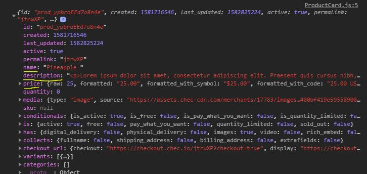

# Listing products in a catalogue using React.js and Commerce.js SDK

This guide illustrates how to display a list of products using React.js & Commerce.js (SDK)

* [Live demo for this Guide: "***Listing products in catalogue***"](https://listing-products-commercejs.netlify.com/)
* [Live demo for entire integration (storefront > cart > checkout)](https://seities-store-cjs-react-guide.netlify.com/)


****** *Note* ******

1. *This guide is using v2 of the SDK*
2. *The Live Demo is best viewed on Desktop (**responsiveness limited**)*


## Overview
The purpose of this guide is to help developers get familiar with using the Commerce.js SDK in conjunction with React. Commerce.js is a powerful eCommerce tool that gives you the ability to build custom eCommerce sites without the headache of building out a lot of the complex functionality that comes with eCommerce projects. Commerce.js makes it easier for less experienced developers or eager online entrepreneurs to build a more controlled and customized online store without relying on the big players like Shopify. Let's dive in!

#### This guide will cover: 

1. Adding Products to the Chec Dashboard
2. Using the Commerce.js SDK to access dashboard data
3. Implementing Commerce.js in a React App
4. Displaying a list of products on the screen

*This guide will not go into detail about other features/functionality within an eCommerce site such as: adding to cart, product page, checking out etc ... It will simply give a blueprint to how you can display a list of products specifically with React. Further, this guide strictly utilizes functional React components and relies heavenly on React Hooks.*

### Requirements/Prerequisites

- [ ] IDE of your choice (code editor)
- [ ] [NodeJS](https://nodejs.org/en/), or [yarn](https://classic.yarnpkg.com/en/docs/install/#windows-stable) → npm or yarn.
- [ ] Some knowledge of Javascript & React
- [ ] *Bonus* - Using [React Hooks](https://reactjs.org/docs/hooks-reference.html) - specifically `useState()`, `useEffect()`
- [ ] *Bonus* - familiarity with the framework [Semantic UI (react) library](https://react.semantic-ui.com/)

## Getting Started

### STEP 1. Create a Chec account and upload Product Info:

It should be noted that there are two main components, Chec (dashboard) and Commerce.js SDK. Think of Chec as the logic layer, the source of all your customer data, transactions - things of that nature. Think of the SDK as your way to communicate with your data. You'll need to create an account [HERE](https://dashboard.chec.io/signup) - once logged in, navigate to products. The only product data you need to get started is: **Name, Image, Price, Description.**


#### Important Chec Dashboard Features

Once you've added some products check out some of the features in setup.  Important things like developer API keys that can be used if you want to connect directly the Chec API.  Further click on Payment Gateways.  This is where you can enable different payment platforms for processing payments.   

### STEP 2. React Time! (Getting your App setup):

This is where the fun begins! This example was done using CRA ([create-react-app](https://create-react-app.dev/docs/getting-started/)). If you're familiar with React, then you know all about CRA. If you don't want to fire up a project from scratch, you can fork and clone this repository (make sure to navigate to the proper folder) and run:

`yarn install or npm install`

This command will install the necessary dependencies needed for this project. This also includes the package needed for the Commerce.js SDK. Once installed, run `yarn start` to run the app using React's development server.

##### Installing Commerce.js manually

One of the great things about the Commerce.js SDK is its ease of use.  Getting what you need into the project is very simple.

1. [Installing via CDN](https://commercejs.com/docs/overview/getting-started.html)

```
<script type="text/javascript" src="https://assets.chec-cdn.com/v2/commerce.js"></script>
```

2. [Installing via SDK](https://commercejs.com/docs/overview/getting-started.html)

```
npm install @chec/commerce.js
```

### STEP 3. Using Commerce.js in your Project:

Again, the developers at Commerce.js have done their best to make using this tool simple.  If you take a look in the `<ProductContainer />` in this repo (*product-list-cjs-react/src/components/ProductContainer.js*) - this is where the magic happens! In order to connect to the source (***your Chec Dashboard***) you must first import the package: 
```
import Commerce from '@chec/commerce.js'
```
AND Then create your object variable ... 

```
const commerce = new Commerce('YOUR SANDBOX PUBLIC KEY')
```

#### Using the commerce object

Utilizing this object can be tricky in React (*based on life cycle methods and how React renders components*) because the methods or functions on the commerce object all return promises.  The way you handle promises is similiar to how you handle API calls by using `.then()` and `.catch()` or `try` in order to process the data. 

Because React rendering can be triggered for many different reasons, it is best practice to wrap our commerce object method calls into a `useEffect()` hook.  This hook acts as the replacment to `componentWillMount()` function when using class components.  By leaving the second argument array empty, this method will run once before the initial render.

This allows you to safely store the response in state without triggering mulitple re-rendering.  Using state (*which is basically data storage*) is a big part of React and if you look at this example - we are storing the returned data from the promise into state.

```javascript
const commerce = new Commerce('YOUR SANDBOX PUBLIC KEY')
const [products, setProducts] = useState([])

    useEffect(() => {
        commerce.products.list()
          .then(res => {
            setProducts(res.data)
          })
          .catch(err => console.log(err))
    },[])
```
If you notice, the setProducts function updates our products variable with all the info from our Chec Dashboard. 

### STEP 4. Displaying the Product Info:

You now have a variable `products` which is an array of objects and each object being a particular product. You next want to take that data and display it for customers to see! Let's map over the array and pass down each product data as a prop to the `<ProductCard />` component.

```javascript
 return (
        <>
            <Grid stackable columns='equal' centered>
                <Image src={hero} fluid/>
                {products.map(product => <Grid.Column width={5} key={product.id}><ProductCard product={product} /></Grid.Column>)}
            </Grid>
        </>
    );
```

Here's a look at the ProductCard Component where we have parsed the data we need for the display: 

```javascript
const ProductCard = ({product}) => {
   
    return (
        <Card 
            image={product.media.source}
            header={product.name}
            meta={product.price.formatted_with_symbol}
            description={product.description.replace(/(<([^>]+)>)/ig,"")}
        />
    );
};
```

#### Shape of Product Object


[Link to API Product Resource](https://commercejs.com/docs/api/?javascript#list-all-products)


#### Conclusion 

Well there you have it.  A quick guide to getting your products to display using React.  As you can see, it doesn't take much to get some products listed on your site.  

Let's take a step back and quickly summarize what we accommplished.

- Created a Chec account and added products
- Created a React project and installed the Commerce.js SDK
- Using the SDK and injecting the commerce object into our project 
- Using the reponse to display product info on the page

If you're ready for the next step - check out the next guide: 

-> [Adding Products To the Cart](https://github.com/kingmoc/adding-products-cart-cjs-react)

___

[Live demo for this Guide: "***Listing products in catalogue***"](https://listing-products-commercejs.netlify.com/)

[Live demo for entire integration (storefront > cart > checkout)](https://seities-store-cjs-react-guide.netlify.com/)

## Built With

* [React.Js](https://reactjs.org/docs/getting-started.html)
* [Semantic-UI](https://react.semantic-ui.com/)
* [Commerce.js (SDK)](https://commercejs.com/docs/)


